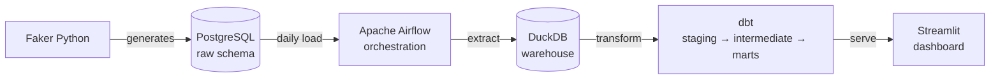

# E-Commerce Sales Pipeline


A Data Engineering portfolio project that generates synthetic e-commerce data and builds a production-style pipeline: from raw ingestion through transformation to an interactive dashboard.

**Data scale:** 10,000 customers · 500 products · 50,000+ orders · ~210k records total

## Architecture



## Tech Stack

| Layer | Tool |
|---|---|
| Data Generation | Python 3.11 + Faker |
| Raw Storage | PostgreSQL 15 |
| Orchestration | Apache Airflow 2.8 |
| Transformation | dbt-core 1.11 + dbt-duckdb |
| Data Warehouse | DuckDB 0.10 |
| Dashboard | Streamlit 1.31 + Plotly |
| Infrastructure | Docker + Docker Compose |
| CI | GitHub Actions |

## Quick Start

```bash
git clone https://github.com/altayburakhan/Datafaction.git
cd Datafaction

cp .env.example .env        # Fill in your credentials
make init                   # Initialize Airflow DB + create admin user
make up                     # Start all services
make generate               # Generate full dataset (10k customers, 50k orders)
```

- Airflow UI → http://localhost:8080 (admin / admin)
- Dashboard → http://localhost:8501

## Project Structure

```
ecommerce-pipeline/
├── airflow/
│   └── dags/               # Airflow DAG definitions
├── data_generator/         # Faker-based data generation scripts
├── dbt/
│   └── models/
│       ├── staging/        # Raw → cleaned views
│       ├── intermediate/   # Enriched joins
│       └── marts/          # Business-ready tables
├── dashboard/
│   ├── app.py              # Streamlit entry point
│   └── pages/              # Sales / Product / Customer pages
├── docker-compose.yml
├── .env.example
└── Makefile
```

## dbt Models

| Model | Type | Description |
|---|---|---|
| `stg_customers` | view | Cleaned customer data |
| `stg_products` | view | Cleaned product data with margin |
| `stg_orders` | view | Cleaned orders with date parts |
| `stg_order_items` | view | Cleaned order line items |
| `int_orders_enriched` | view | Orders joined with customers and items |
| `mart_sales_daily` | table | Daily revenue, growth rate, cancellation rate |
| `mart_customer_segments` | table | RFM-based segmentation (Champions / Loyal / At Risk / Lost) |
| `mart_product_performance` | table | Revenue, units sold, refund rate per product |

## Data Quality

26 dbt tests run automatically as part of the pipeline (`run_dbt_tests` task in Airflow):

| Test type | What it checks |
|---|---|
| `not_null` | ID fields, dates, required columns |
| `unique` | Primary keys across all staging models |
| `accepted_values` | `order_status` is one of: pending, completed, cancelled, refunded |
| `relationships` | Foreign key integrity (customer_id, product_id) |

All tests must pass for the DAG to complete successfully.

## Dashboard Pages

| Page | Charts |
|---|---|
| Sales Overview | Daily revenue trend, monthly bar chart, cancellation rate trend, KPI cards |
| Product Analysis | Top 10 products, category revenue pie, revenue vs refund rate scatter |
| Customer Segments | RFM segment distribution, revenue by segment, recency vs frequency scatter |

## Useful Commands

```bash
make up         # Start all Docker services
make down       # Stop all services
make generate   # Run full data generation
make test       # Run dbt tests
make logs       # Tail Airflow scheduler logs
make clean      # Remove containers and volumes
```
