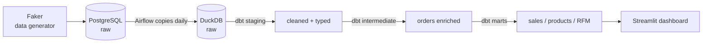

# Datafaction


I built this to practice the full data engineering loop: generate realistic data, orchestrate a daily pipeline, model it in layers, and surface something actually useful at the end. Everything runs locally with Docker, no cloud account needed.

The domain is a fake e-commerce shop. Faker generates customers, products, and orders. Airflow drives a daily pipeline. dbt transforms the data through a medallion architecture. Streamlit + Plotly reads from DuckDB and renders the dashboard.

## Architecture



Full load volumes: **10k customers**, **500 products**, **50k orders**.

## What this project covers

- **Medallion architecture** with dbt: raw -> staging -> intermediate -> marts
- **Window functions** throughout the mart layer: `LAG` for day-over-day revenue growth, `RANK` for per-category product ranking, `NTILE` for RFM scoring
- **RFM segmentation** (Recency, Frequency, Monetary) using `NTILE(5)` windows to score and bucket customers into Champions, Loyal, At Risk, Lost, etc.
- **Synthetic data generation** with Faker and custom weighted distributions (order statuses, discounts), tested with pytest
- **Airflow orchestration**: daily DAG that seeds orders, syncs PostgreSQL to DuckDB, runs dbt models, then runs dbt tests
- **AI Insights agent** that reads mart data and surfaces automated trend/anomaly observations in the dashboard
- **79 tests** across three layers: data generator (36), dbt data quality (26), insight agent (17)

## Stack

| Layer | Tool |
|-------|------|
| Raw ingestion | Python + Faker + SQLAlchemy -> PostgreSQL |
| Orchestration | Apache Airflow 2.8 |
| Warehouse | DuckDB 0.10 |
| Transformation | dbt 1.7 |
| Dashboard | Streamlit 1.31 + Plotly |
| Infrastructure | Docker Compose |

## dbt models

Three-layer medallion architecture:

| Layer | Models | What it does |
|-------|--------|--------------|
| **staging** | `stg_customers`, `stg_orders`, `stg_order_items`, `stg_products` | Cast types, trim strings, filter nulls. No business logic. |
| **intermediate** | `int_orders_enriched` | Orders joined with customer info and item aggregates. Days-since-signup computed here. |
| **marts** | `mart_sales_daily` | Daily revenue, order counts, cancellation rate, day-over-day growth (`LAG`) |
| | `mart_product_performance` | Per-product revenue, refund rate, gross profit, category rank (`RANK`) |
| | `mart_customer_segments` | RFM scores via `NTILE(5)`, segment labels, monetary value |

dbt tests run at the end of every pipeline run: `not_null`, `unique`, relationship checks, and custom threshold tests. 26 tests total.

## Run it locally

**Prerequisites:** [Docker Desktop](https://www.docker.com/products/docker-desktop/) running.

```bash
git clone https://github.com/altayburakhan/Datafaction.git
cd Datafaction

cp .env.example .env   # fill in Fernet key and passwords
make init              # initialize Airflow DB and create admin user
make up                # start Postgres, Airflow, Streamlit (allow ~30s)
make generate          # seed the database with synthetic data (~2 min)
```

Open:

| What | URL | Login |
|------|-----|-------|
| Airflow | http://localhost:8080 | `admin` / `admin` |
| Dashboard | http://localhost:8501 | no auth |

In Airflow, trigger the **`ecommerce_daily_pipeline`** DAG manually the first time. Each run: generates that day's orders -> copies raw tables to DuckDB -> `dbt run` -> `dbt test`.

## Connecting a DB client (DBeaver, psql, etc.)

| DB | Host | Port | Database | User | Password |
|----|------|------|----------|------|----------|
| PostgreSQL (raw layer) | `localhost` | `5433` (`POSTGRES_HOST_PORT` in `.env`) | `ecommerce_raw` | `ecommerce_user` | `ecommerce_pass` |

Port defaults to `5433`, not Postgres' usual `5432` — this avoids clashing with a Postgres already running locally on your machine. Internal pipeline traffic (Airflow <-> Postgres) always uses `5432` on the docker network and isn't affected by this setting. If `5433` is also taken on your machine, change `POSTGRES_HOST_PORT` in `.env` and re-run `docker compose up -d postgres`.

DuckDB (staging/intermediate/marts tables produced by dbt) lives inside the `airflow_data` docker volume, not directly on the host filesystem. To open it in a DuckDB-capable client, copy it out first:

```bash
docker compose cp airflow-scheduler:/opt/airflow/data/warehouse.duckdb ./warehouse.duckdb
```

Other commands:

```bash
make test      # run dbt tests only
make logs      # follow the Airflow scheduler logs
make down      # stop all containers
make clean     # stop + wipe volumes and dbt artifacts
```

## Tests

**Data generator** (36 tests, covers all three generators and DB helpers):

```bash
cd data_generator
pip install -r requirements.txt
pytest
```

**Insight agent** (17 tests):

```bash
cd agents
pip install pandas numpy duckdb pytest
pytest
```

**dbt tests** run automatically inside the pipeline, or manually:

```bash
make test
```

## Repo layout

```
airflow/dags/          # ecommerce_daily_pipeline DAG
data_generator/        # Faker-based generator + pytest suite
dbt/models/            # staging -> intermediate -> marts
dashboard/pages/       # Streamlit pages (sales, products, RFM, AI insights)
agents/                # rule-based insight agent + pytest suite
docker-compose.yml
Makefile
```

---

If something breaks after a fresh clone, `make clean && make init && make up && make generate` resets everything. Issues and PRs welcome.
