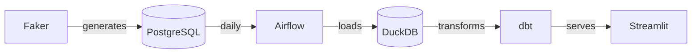

# E-Commerce Sales Pipeline


A portfolio project I built to practice the full data engineering stack. It generates synthetic e-commerce data (10k customers, 500 products, 50k orders), runs it through a daily Airflow pipeline, transforms it with dbt, and serves it on a Streamlit dashboard.

## How it works



Everything runs locally via Docker Compose — no cloud setup needed.

## Getting started

You'll need Docker Desktop running.

```bash
git clone https://github.com/altayburakhan/Datafaction.git
cd Datafaction
make init    # copies .env.example → .env and initialises Airflow
make up      # starts all containers (Postgres, Airflow, Streamlit, pgAdmin)
make generate  # generates the full dataset and loads it into the warehouse
```

- Airflow → http://localhost:8080 (admin / admin)
- Dashboard → http://localhost:8501
- pgAdmin → http://localhost:5050

After `make up`, trigger the `ecommerce_pipeline` DAG manually from the Airflow UI or just wait — it runs on a daily schedule.

## Stack

| | |
|---|---|
| Raw storage | PostgreSQL 15 |
| Orchestration | Apache Airflow 2.8 |
| Warehouse | DuckDB |
| Transformation | dbt-core 1.11 |
| Dashboard | Streamlit + Plotly |
| Infrastructure | Docker Compose |

## dbt layers

- **staging** — type casting, null handling, no business logic
- **intermediate** — joins orders with customers and line items
- **marts** — `mart_sales_daily`, `mart_customer_segments` (RFM), `mart_product_performance`

26 tests (not_null, unique, relationships, accepted_values) run automatically as the last step of every pipeline run.

## Project layout

```
airflow/dags/       # pipeline DAG
data_generator/     # Faker scripts
dbt/models/         # staging → intermediate → marts
dashboard/pages/    # one file per Streamlit page
docker-compose.yml
Makefile
```
