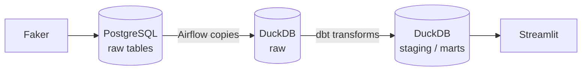

# Datafaction


I built this to learn the full data engineering loop — not just SQL in isolation, but how pieces actually connect: generate data, orchestrate it, model it, and show something useful at the end.

It's a small fake e-commerce shop. Faker creates customers, products, and orders. Airflow runs a daily job. dbt cleans and builds marts. Streamlit reads from DuckDB and draws a few charts. Everything runs on your machine with Docker — no cloud account needed.

## What happens under the hood



Rough volumes on a full load: **10k customers**, **500 products**, **50k orders**.

## Run it locally

**Prerequisites:** [Docker Desktop](https://www.docker.com/products/docker-desktop/) running, Python 3.11+ available in your terminal.

```bash
git clone https://github.com/altayburakhan/Datafaction.git
cd Datafaction

make init       # copies .env, auto-generates secret keys, initializes Airflow DB
make up         # starts Postgres, Airflow, Streamlit (allow ~30s for services to become healthy)
make generate   # seeds the database with synthetic data (~2 min)
```

Then open:

| What | URL | Login |
|------|-----|-------|
| Airflow | http://localhost:8080 | `admin` / `admin` |
| Dashboard | http://localhost:8501 | — |

In Airflow, the DAG is called **`ecommerce_daily_pipeline`**. Trigger it manually the first time, or let the daily schedule pick it up. Each run: adds that day's orders → copies raw tables to DuckDB → `dbt run` → `dbt test`.

Other handy commands:

```bash
make test      # dbt tests only
make logs      # follow the scheduler
make down      # stop containers
make clean     # stop + wipe volumes and dbt artifacts
```

## Stack

PostgreSQL (raw) · Airflow 2.8 · DuckDB (warehouse) · dbt 1.7 · Streamlit + Plotly · Docker Compose

## dbt models

| Layer | What it does |
|-------|----------------|
| **staging** | Cast types, drop bad rows — no business rules yet |
| **intermediate** | Orders joined with customers and line items |
| **marts** | Daily sales, RFM segments, product performance |

Data quality tests run at the end of every pipeline (`not_null`, `unique`, relationships, and a few custom checks). 26 tests total.

## Repo layout

```
airflow/dags/          # ecommerce_daily_pipeline
data_generator/        # synthetic data + pytest (36 tests)
dbt/models/            # staging → intermediate → marts
dashboard/pages/       # Streamlit pages
docker-compose.yml
Makefile
```

## Tests

Generator unit tests (run outside Docker):

```bash
cd data_generator
pip install -r requirements.txt
pytest
```

---

If something breaks after a fresh clone, `make clean && make init && make up && make generate` usually resets things. Issues and ideas welcome.
