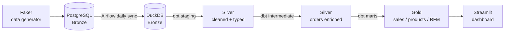
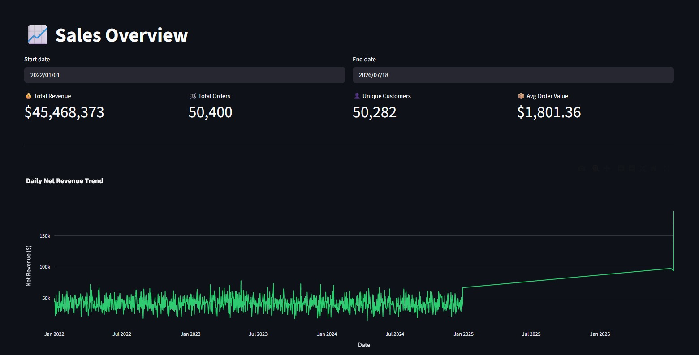
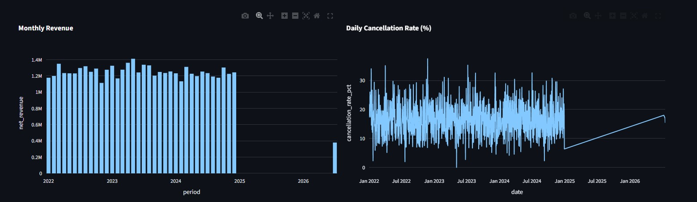
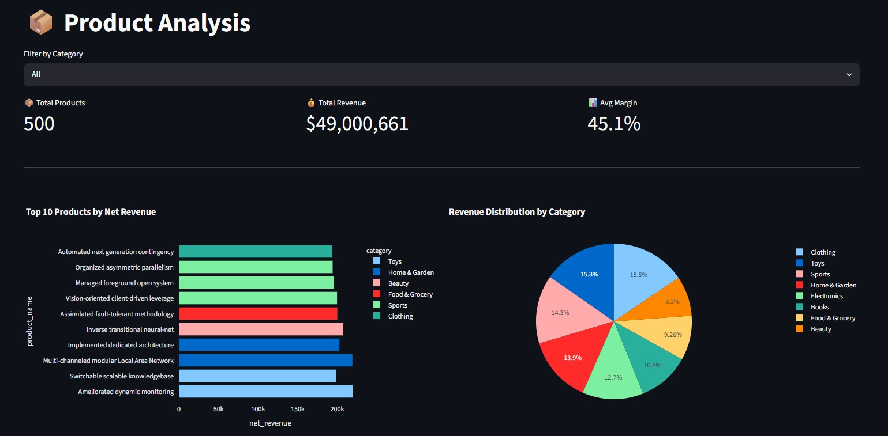
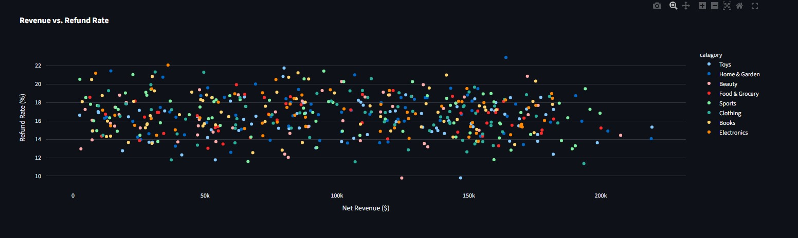
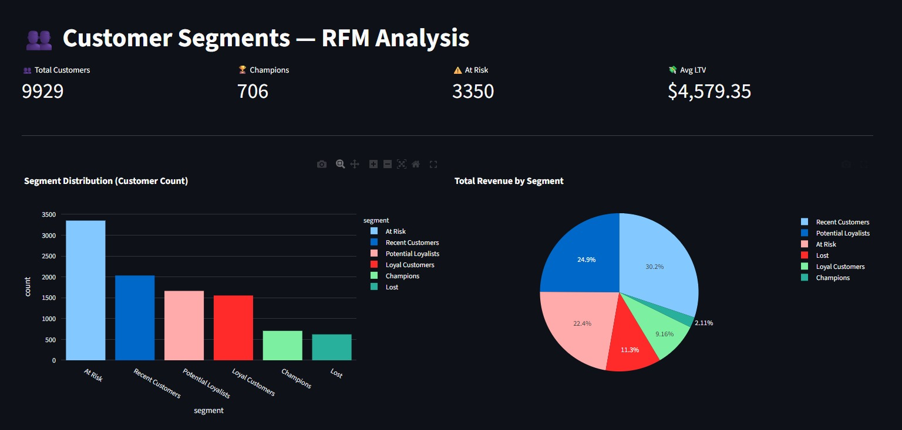
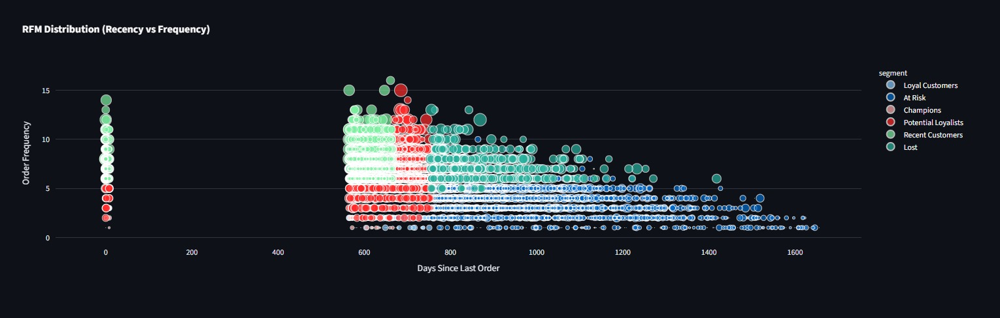
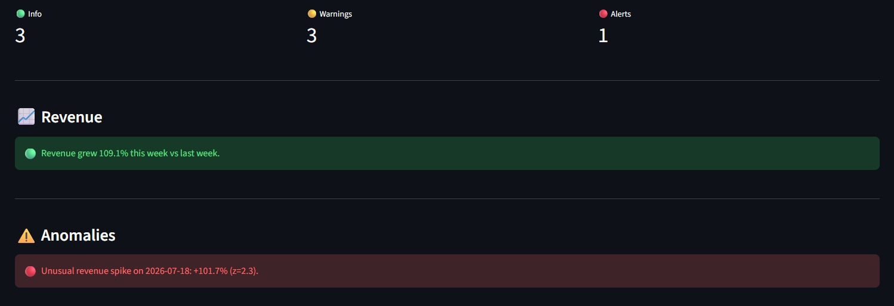

# Datafaction


Datafaction is an end-to-end data engineering project I built to simulate how a real e-commerce company would manage its data, from raw ingestion to business-ready dashboards. I designed and implemented the full pipeline myself: synthetic data generation, orchestration, layered data modeling, and a reporting layer on top.

The goal was to practice the same problems data engineers deal with in production: moving data reliably between systems, cleaning and transforming it in a structured way, and making it usable for analytics without recruiters or engineers needing to touch raw tables. I used a Medallion Architecture (Bronze/Silver/Gold) to organize the transformations, and orchestrated the daily run with Airflow.

Everything runs locally with Docker Compose, so the whole pipeline (database, orchestrator, transformation layer, and dashboard) can be spun up with a couple of commands.

## Project Goal

I wanted a project that demonstrates the full data engineering lifecycle rather than just one piece of it. So I built:

- A synthetic data source (customers, products, orders) instead of relying on a static CSV, so the pipeline has to deal with daily incremental loads like a real system would.
- An orchestrated ETL/ELT pipeline that runs on a schedule, not a one-off script.
- A layered transformation model (raw -> staging -> intermediate -> marts) so business logic is traceable and testable at every step.
- A dashboard on top, so the pipeline's output is actually consumable, not just tables sitting in a warehouse.

## Architecture

I used a Medallion Architecture to separate raw data from business-ready data:

- **Bronze (raw):** Faker-generated data lands in PostgreSQL untouched, exactly as the source system produced it.
- **Silver (staging + intermediate):** dbt casts types, trims strings, drops nulls, and joins orders with customer and item data. No business logic yet, just clean, typed, reliable data.
- **Gold (marts):** Business-level aggregates (daily sales, product performance, customer segments) ready to be queried directly by the dashboard.



At full scale, the pipeline handles 10k customers, 500 products, and 50k orders.

## Technologies I Used

| Layer | Tool | Why I chose it |
|-------|------|-----------------|
| Data generation | Python + Faker + SQLAlchemy | Realistic, weighted synthetic data instead of flat random values |
| Raw storage | PostgreSQL | Standard relational store for the raw/Bronze layer |
| Orchestration | Apache Airflow 2.8 | Schedules and monitors the daily ETL run as a DAG |
| Warehouse | DuckDB | Fast local OLAP engine for the Silver/Gold layers |
| Transformation | dbt 1.7 | SQL-based modeling, testing, and lineage between layers |
| Dashboard | Streamlit + Plotly | Turns the Gold layer into an interactive report |
| Infrastructure | Docker Compose | Runs the entire stack locally with one command |

## Data Flow

1. **Generate:** Python/Faker creates that day's customers, products, and orders and writes them to PostgreSQL.
2. **Extract:** Airflow copies the raw PostgreSQL tables into DuckDB.
3. **Transform (Silver):** dbt staging models clean and type the data; the intermediate model enriches orders with customer and item-level details.
4. **Transform (Gold):** dbt mart models aggregate the Silver layer into daily sales, product performance, and customer segments.
5. **Test:** dbt tests run automatically after every transformation: not_null, unique, relationship, and custom threshold checks.
6. **Serve:** Streamlit reads directly from the Gold layer and renders the dashboard.

This whole sequence runs daily as a single Airflow DAG, so each run only processes that day's increment rather than reprocessing everything from scratch.

## Key Features

- **Medallion Architecture:** clear separation between raw, cleaned, and business-ready data, which makes debugging and testing far easier than a flat, single-layer model.
- **SQL window functions in production-style queries:** used for ranking, cumulative growth, and scoring instead of slower, harder-to-read self-joins or subqueries.
- **RFM customer segmentation:** scores every customer on Recency, Frequency, and Monetary value and buckets them into segments like Champions, Loyal, At Risk, and Lost.
- **Incremental daily processing:** the pipeline is designed around daily batch loads, not a one-time full reload, which matches how most real ETL pipelines actually operate.
- **Automated data quality testing:** 26 dbt tests catch broken assumptions (nulls, duplicates, broken relationships) before bad data reaches the dashboard.
- **A lightweight AI insight agent:** reads the Gold layer and surfaces plain-language observations (trends, anomalies) on the dashboard, on top of the raw charts.
- **79 automated tests total** across the data generator, dbt models, and the insight agent.

## Dashboard

**Sales Overview** — daily net revenue trend, monthly revenue, and daily cancellation rate:




**Product Analysis** — top products by revenue, category breakdown, and revenue vs. refund rate:




**Customer Segments (RFM Analysis)** — segment distribution, revenue share per segment, and recency/frequency spread:




**AI Insights** — automated trend and anomaly detection on top of the Gold layer:



## Example: SQL Window Functions

Day-over-day revenue growth with `LAG`, from `mart_sales_daily.sql`:

```sql
with_prev AS (
    SELECT
        *,
        LAG(net_revenue) OVER (ORDER BY date) AS prev_day_revenue
    FROM daily
)

SELECT
    *,
    ROUND((net_revenue - prev_day_revenue) / NULLIF(prev_day_revenue, 0) * 100, 2) AS revenue_growth_pct
FROM with_prev
```

Product ranking within category with `RANK`, from `mart_product_performance.sql`:

```sql
RANK() OVER (PARTITION BY p.category ORDER BY a.net_revenue DESC NULLS LAST) AS category_rank
```

Customer scoring with `NTILE`, from `mart_customer_segments.sql`:

```sql
NTILE(5) OVER (ORDER BY recency_days DESC) AS r_score,
NTILE(5) OVER (ORDER BY frequency DESC)    AS f_score,
NTILE(5) OVER (ORDER BY monetary DESC)     AS m_score
```

I used window functions here instead of subqueries or self-joins to keep growth, ranking, and scoring calculations both faster and easier to read.

## Skills I Practiced

- Designing a layered data warehouse using Medallion Architecture principles
- Writing SQL window functions for ranking, growth, and scoring calculations
- Orchestrating a daily batch ETL pipeline with Airflow
- Building and testing dbt models across staging, intermediate, and mart layers
- Implementing customer segmentation (RFM) as a real analytical use case
- Containerizing a full data stack with Docker Compose
- Writing automated tests for data pipelines (data generator, dbt, and application logic)

## Setup

**Requirements:** [Docker Desktop](https://www.docker.com/products/docker-desktop/)

```bash
git clone https://github.com/altayburakhan/Datafaction.git
cd Datafaction
cp .env.example .env
make init
make up
make generate
```

| What | URL | Login |
|------|-----|-------|
| Airflow | http://localhost:8080 | `admin` / `admin` |
| Dashboard | http://localhost:8501 | no auth |

Trigger the `ecommerce_daily_pipeline` DAG in Airflow once to run the first load. Run tests with `make test`, or `cd data_generator && pytest` / `cd agents && pytest` for the Python test suites.

---

## Bullet Points

- Designed and built an end-to-end ETL pipeline using a Medallion Architecture (Bronze/Silver/Gold) with Airflow, dbt, PostgreSQL, and DuckDB, processing 50k+ synthetic orders daily.
- Implemented SQL window functions (`LAG`, `RANK`, `NTILE`) to calculate revenue growth, product rankings, and RFM customer scores directly in the data warehouse.
- Built a customer segmentation model (RFM analysis) that classifies customers into actionable segments such as Champions, At Risk, and Lost.
- Orchestrated a daily batch pipeline in Apache Airflow, including automated dbt testing (26 data quality tests) to catch broken data before it reached reporting.
- Developed an interactive Streamlit dashboard, including a rule-based insight agent that surfaces automated trend and anomaly observations from the data.
